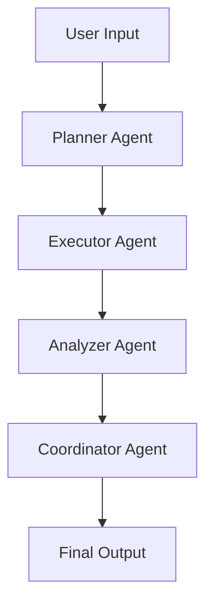

🚀 Aestura — Autonomous Multi-Agent System


---

🧠 Overview

Aestura is an autonomous multi-agent AI system built for experimenting with collaborative intelligence between multiple AI agents.

It was developed as part of a Kaggle hackathon initiative in collaboration with Google DeepMind’s “Vibe Code with Gemini 3 Pro” challenge in AI Studio.

The system demonstrates how structured agent collaboration can solve complex tasks more efficiently than a single AI model.

---

🎯 Problem Statement

Traditional AI systems rely on a single model, which limits scalability, specialization, and workflow efficiency.

Aestura solves this by:

* Distributed intelligence across agents
* Role-based task execution
* Structured workflow automation
* Collaborative decision-making

---

⚙️ System Architecture



---

🤖 Agent Roles

🧠 Planner Agent

* Breaks tasks into structured steps
* Defines execution plan

⚡ Executor Agent

* Performs operations and logic execution
* Handles task processing

🔍 Analyzer Agent

* Validates outputs
* Ensures correctness

🎛️ Coordinator Agent

* Manages workflow between agents
* Controls execution flow

---

🔄 Workflow

1. User submits task
2. Planner creates steps
3. Executor processes tasks
4. Analyzer validates output
5. Coordinator finalizes result

---

🛠️ Tech Stack

* Python
* Large Language Models (LLMs)
* Multi-Agent System Design
* AI Workflow Automation
* Backend Architecture

---

📌 Key Features

* Multi-agent collaboration system
* Structured task decomposition
* Modular architecture
* Scalable AI workflow design
* Intelligent coordination system

---

🎨 System Visualization

```
        ┌──────────────┐
        │   USER INPUT │
        └──────┬───────┘
               ↓
     ┌───────────────────┐
     │  PLANNER AGENT    │
     └──────┬────────────┘
            ↓
     ┌───────────────────┐
     │ EXECUTOR AGENT    │
     └──────┬────────────┘
            ↓
     ┌───────────────────┐
     │ ANALYZER AGENT    │
     └──────┬────────────┘
            ↓
     ┌───────────────────┐
     │ COORDINATOR AGENT │
     └──────┬────────────┘
            ↓
     ┌──────────────┐
     │ FINAL OUTPUT │
     └──────────────┘
```

---

🚀 Purpose

This project explores:

* Multi-agent AI systems
* Distributed intelligence
* LLM-based collaboration
* Workflow automation
* Scalable AI architectures

---

🌍 Use Cases

* AI workflow automation
* Intelligent task decomposition
* Research assistants
* Multi-step reasoning systems
* AI orchestration frameworks

---

🔮 Future Improvements

* Real-time agent communication
* Web-based dashboard
* Memory system for agents
* API integrations
* Enhanced reasoning engine

---

🏁 Hackathon Context

Developed for:

* Kaggle AI Hackathon
* Google DeepMind “Vibe Code with Gemini 3 Pro” challenge
* AI Studio experimentation

---

📄 License

Open-source project for educational and research purposes.

